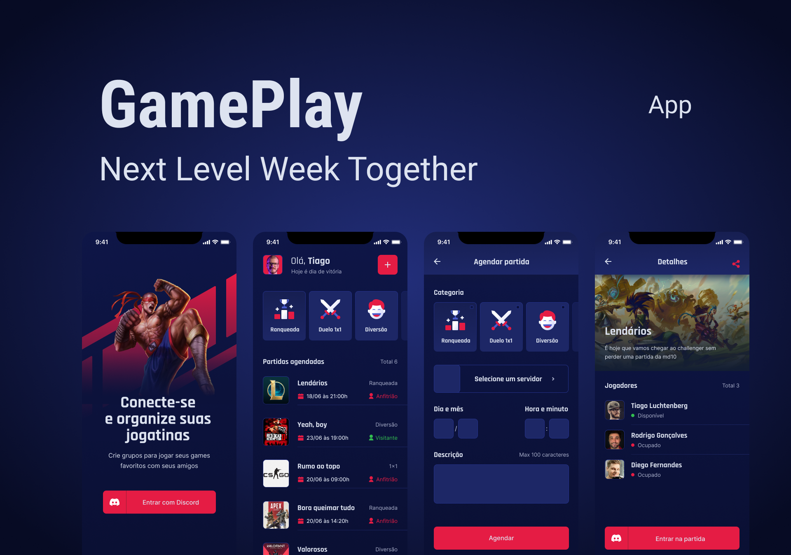

<p align="center">
  
</p>

<h1 align="center">
    
</h1>

<br>

## 🧪 Technologies

This project was developed using the following technologies:
 
- [React Native](https://reactnative.dev/)
- [Expo](https://expo.io/)

## 🚀 Getting started

Clone the project and access the folder.

```bash
$ https://github.com/MatheusFrez/gameplay-react-native.git
$ cd gameplay-react-native
```

Remember to create your App on the Discord server to get the authentication credentials. Then define your App settings in the .env file (remove the example from the .env.example file).
 
 ```cl
REDIRECT_URI=
SCOPE=
RESPONSE_TYPE=
CLIENT_ID=
CDN_IMAGE=
```

Follow the steps below:
```bash
# Install the dependencies
$ yarn

# Start the project
$ expo start
```

## 🔖 Layout

You can view the project layout through the links below:

- [Layout](https://www.figma.com/file/0kv33XYjvOgvKGKHBaiR07/GamePlay-NLW-Together/duplicate) 

Remembering that you need to have a [Figma](http://figma.com/) account to access it.
